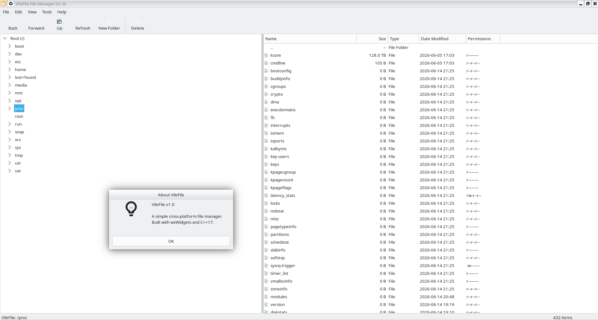

# VileFile

A simple file manager built with wxWidgets and C++17. MVC architecture separates
filesystem logic from the GUI.

## Build

### CMake (recommended)

```bash
sudo apt install libwxgtk3.2-dev catch2 cmake g++

mkdir build && cd build
cmake -DCMAKE_BUILD_TYPE=Release ..
make -j$(nproc)
./VileFile
```

Run tests (from the build directory): `./vilefile-tests`

### Manual (g++)

```bash
sudo apt install libwxgtk3.2-dev g++

g++ -std=c++17 $(wx-config --cxxflags) -o VileFile main.cpp model.cpp view.cpp $(wx-config --libs)
./VileFile
```

## Usage

- **Tree** (left) — expand folders to browse, click to view contents.
- **File list** (right) — click headers to sort by Name, Size, Type, Date, Permissions.
- **Toolbar** — Back, Forward, Up, Refresh, New Folder, Delete.
- **Menu bar** — File, Edit, View (sort options), Help (About).
- **Keyboard** — F5 = Refresh, Del = Delete.



## License

MIT — see [LICENSE](LICENSE)
